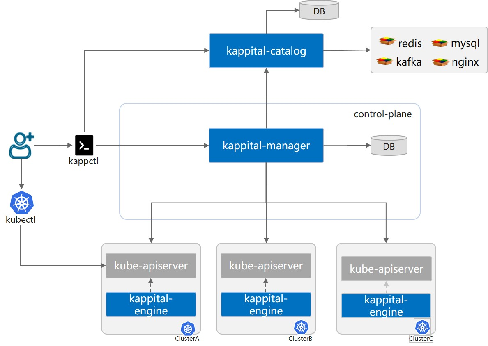

# Kappital

Kappital is an open source project that enables developers to manage cloud native applications across multiple clouds and edges
with no changes to developer's applications. Kappital defines Cloud Native Service Package specifications. By complying with spec,
Kappital enhances service capabilities, observability to applications.

## Why Kappital
* **Unified Cloud Native Service Management**
  - Web console and command-line client for centrally manages multiple clusters
  - Full lifecycle management,such as install,upgrade,update,unInstall,state management
* **Declarative Observability With Non-Intrusive**
  - Zero-Code for logging,monitoring and alarm
  - Support CNCF Observability project,such as prometheus, OpenTelemetry,Thanos
* **Multi-Deployment Engine**
  - Support Kubernetes Native deployment
  - Support Helm,Operator-Framework, and other deploy framework

### Architecture

The Kappital consists of the following components:
* Catalog
  - Directory Cloud-Native Service Package. Support OCI storage format.
  - Support HelmChart, Operator-Framework Bundle.
* Manager
  - Support full lifecycle of Cloud-Native Service such as install, upgrade, update and uninstall.

* Service-Engine

## Roadmap

* [2022 Roadmap](./roadmap.md)

## Contributing

If you're interested in being a contributor and want to get involved in
developing the KubeEdge code, please see [CONTRIBUTING](./CONTRIBUTING.md) for
details on submitting patches and the contribution workflow.

## License

KubeEdge is under the Apache 2.0 license. See the [LICENSE](LICENSE) file for details.