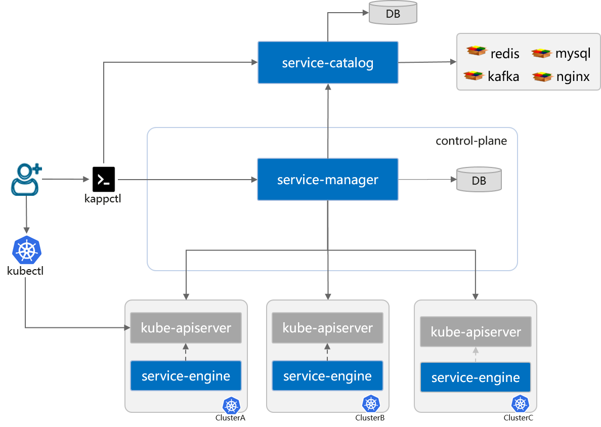

# Kappital

__THIS PROJECT IS CURRENTLY IN PREVIEW. THE CODE AND DOCS ARE SUBJECT TO CHANGE WITHOUT NOTICE.__

Kappital is an open source project that enables developers to manage cloud native applications across multiple clouds and edges
with no changes to developer's applications. Kappital defines [Cloud Native Service Package Specifications](./docs/spec/cloud_native_serivce_package_specification.md).
By complying with spec, Kappital enhances service capabilities, observability to applications.

## Why Kappital
* **Unified Cloud Native Service Management**
  - Web console and command-line client for centrally manages multiple clusters
  - Full lifecycle management,such as install,upgrade,update,unInstall,state management
* **Declarative Observability With Non-Intrusive**
  - Zero-Code for logging,monitoring and alarm
  - Support CNCF Observability project,such as prometheus, OpenTelemetry,Thanos
* **Multi-Deployment Engine**
  - Support Kubernetes Native deployment
  - Support Helm,Operator-Framework, and other deploy framework

### Architecture

The Kappital consists of the following components:
* **Service-Catalog**
  - Directory Cloud-Native Service Package. Support OCI storage format.
  - Support HelmChart, Operator-Framework Bundle.
* **Service-Manager**
  - Support full lifecycle of Cloud-Native Service such as install, upgrade, update and uninstall.
  - Deploy multi-cloud/multi-cluster/cloud-edge without any modifications.
  - Support Day2 Operation.
* **Service-Engine**
  - Support popular frameworks such as Helm,operator-framework.
  - Provide observability plugins. Enable monitoring,logging, alarm,etc.

## Cloud Native Service Package Specifications
Please refer to [Cloud Native Service Package Specifications](./docs/spec/cloud_native_serivce_package_specification.md)
for more details about concepts of Kappital. 

## Roadmap

* [2022 Roadmap](./roadmap.md)

## Contributing

If you're interested in being a contributor and want to get involved in
developing the Kappital code, please see [CONTRIBUTING](./contribute.md) for
details on submitting patches and the contribution workflow.

## License

Kappital is under the Apache 2.0 license. See the [LICENSE](LICENSE) file for details.

